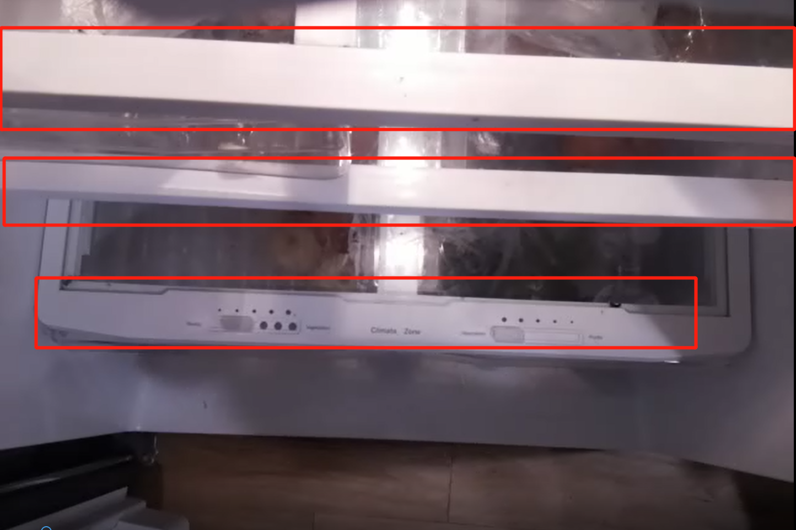

# FreshIO: Smart Fridge Prototype


## [Video Demo](https://youtu.be/CpEttU46jFI)

## Configure the Enviornment
Update packages on your raspberry Pi OS
```
sudo apt-get update
```
Check the python version, you should have version 3.7 or later for running the code.
```
python --version
```
Install virtual environment
```
pip install virtualenv
```
Create a Python virtual environment for TFlite
```
python -m venv ~/tflite
```
Run the following command whenever you open a new terminal window to activate the virtual environment.
```
source ~/tflite/bin/activate
```
Clone this repository
```
git clone https://github.com/Zilinghan/smart-fridge.git smart-fridge
```
Change the directory to the project directory.
```
cd smart-fridge
```
Install Scipy: first run `uname -m` to get the architecture of you raspberry Pi, you should see something like `armv7l`. Then go to [this link](https://www.piwheels.org/simple/scipy/) to download the correponding wheel for your python version and arch. For example you need to download `SciPy-1.8.1-cp39-cp39-linux_armv7l.whl` for `scipy 1.8.1` if your python version is `3.9.X `and your arch is `armv7l`. Then go to the download folder and run the following command to install it (you need to change the .whl name accrodingly).

```
pip install SciPy-1.8.1-cp39-cp39-linux_armv7l.whl
```

Install the dependencies
```
pip install -r requirements.txt
```

## Download Trained Models
For this project, we have trained 5 different food detection models of various sizes. We start from EfficientDet-LiteX object detection models pretrained on COCO dataset, and fine-tune them on a custom food dataset. For detailed information of the custom data set and the fine-tuning process, please refer to this [repository](https://github.com/Zilinghan/food-detector). The following table lists the detailed information of the fine-tuned models as well as the corresponding download links.

| Models             | AP    | AP50  | AP75  | Size   |
|--------------------|-------|-------|-------|--------|
| [EfficientDet-Lite0](https://drive.google.com/file/d/1U_H1PA00m9cZJfpr018TNLx6190MA43D/view?usp=sharing) | 54.00 | 75.03 | 66.02 | 4.24MB |
| [EfficientDet-Lite1](https://drive.google.com/file/d/1fTjnSW6K7JSbjZSKKfhJJ2BIv-JWFNoM/view?usp=sharing) | 55.83 | 75.11 | 62.77 | 5.66MB |
| [EfficientDet-Lite2](https://drive.google.com/file/d/1aYQkU1r-Pqgi5W8O9ZAv7Fh3dAtwhhFp/view?usp=sharing) | 66.46 | 82.66 | 77.15 | 7.05MB |
| [EfficientDet-Lite3](https://drive.google.com/file/d/16Isz62Jy4u5VlfmEHU2hgFv--c5o7J7B/view?usp=sharing) | 81.36 | 96.23 | 89.70 | 11.1MB |
| [EfficientDet-Lite4](https://drive.google.com/file/d/1Os3VKh_Ho-76pTy6atoyrIZjXGJpwRse/view?usp=sharing) | 79.41 | 94.30 | 84.23 | 19.6MB |

Download the your preferred trained detection model from its link, and save it into the `models` folder as `models/model.tflite`.

## Find Suitable Parameter Values
For the landmard-based(LB)-localization algorithm, you need to set up suitable parameter values for your own fridge. To do this, you can run the follow command. Specifically, the localization is based on the greyscale of the landmarks, so you need to find a suitable greyscale threshold ```GREY_THRESH``` for you own fridge, and usually the value lies in the range between ```30``` and ```50```. You need to find a value so that you can see the bounding boxes like the images below. For ```LEVEL```, it is the number of levels of your fridge. For my fridge below, the value of ```LEVEL``` should be set to 3. 

```
python utils/localize.py --grey-thresh GREY_THRESH --level LEVEL
```

 

After tuning suitable ```GREY_THRESH``` value, the program will print something like: ```Suggested level values are [52, 140, 248]```. 


## Run the Code
To run the code, you need to specify at least the following three 
```
python run.py --ip-address IP_ADDRESS --grey-thresh GREY_THRESH --levels LEVLES
```

```IP_ADDRESS``` refers to the IP of your raspberryPi, and you can run ```ifconfig``` of ```ipconfig``` to get the IP of the raspberryPi.  ```GREY_THRESH``` is the greyscale threshold you find in the previous section. For ```LEVELS```, you can use the out suggested values. One example of running the code is:

```
python run.py --ip-address 192.168.10.51 --grey-thresh 30 --levels 52 140 248
```

## What the Code Does
Currently, the code is only composed of the video analysis module and the server for the Android App, it does not integrate with sensor data. When you run the code, you are asked to input either 0 or 1 to simulate the light sensor behavior. When user inputs 1, the camera starts recording, otherwise, the recording stops. The video analysis and server parts are running in separate threads. The codes for our developed Android app can be found in [Shilan's repo](https://github.com/ShellyRiver/SmartFridge_AndroidAPP).


## Discussions and Future Work
Currently, though we have all sensor part codes available, we have not combined them with other parts and test them in the real settings. As for the video analysis module, the main limitation is the lack of training data, and the model is not sufficiently accurate. I believe that more training samples with make this smart fridge prototype more practical in the future. 
